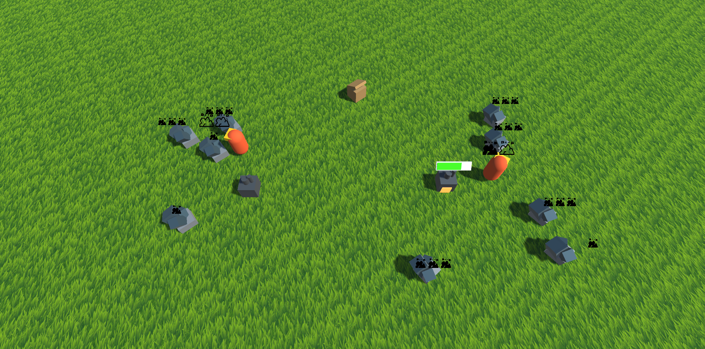
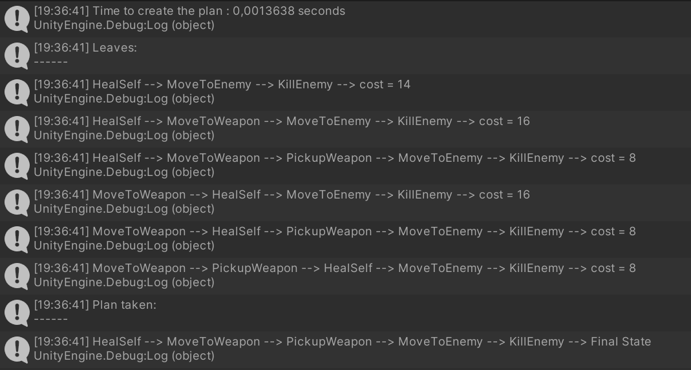
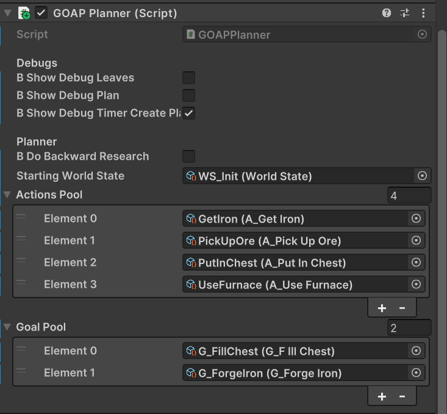
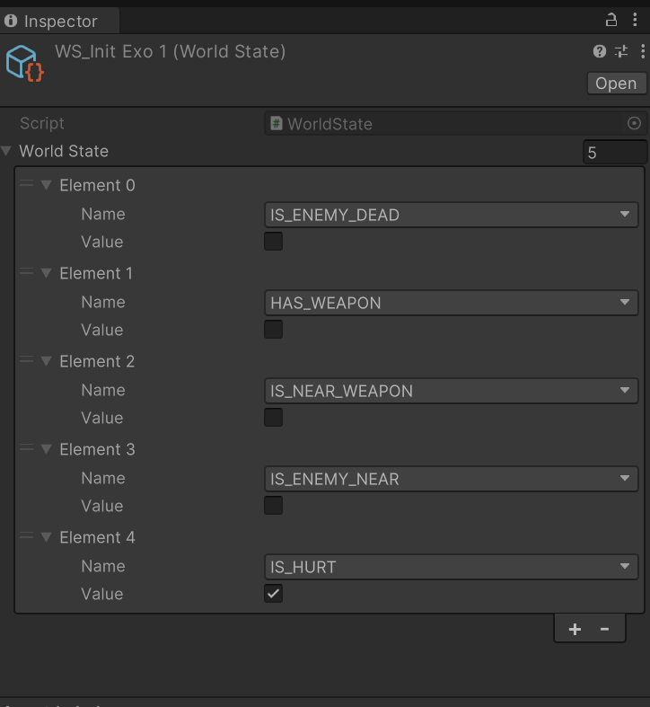
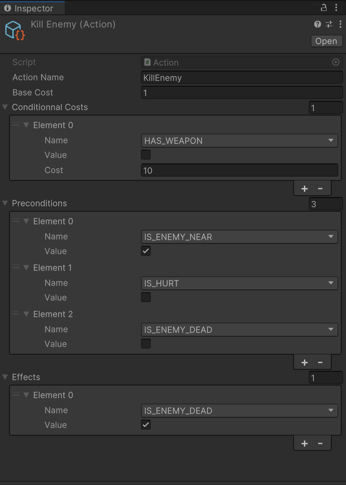
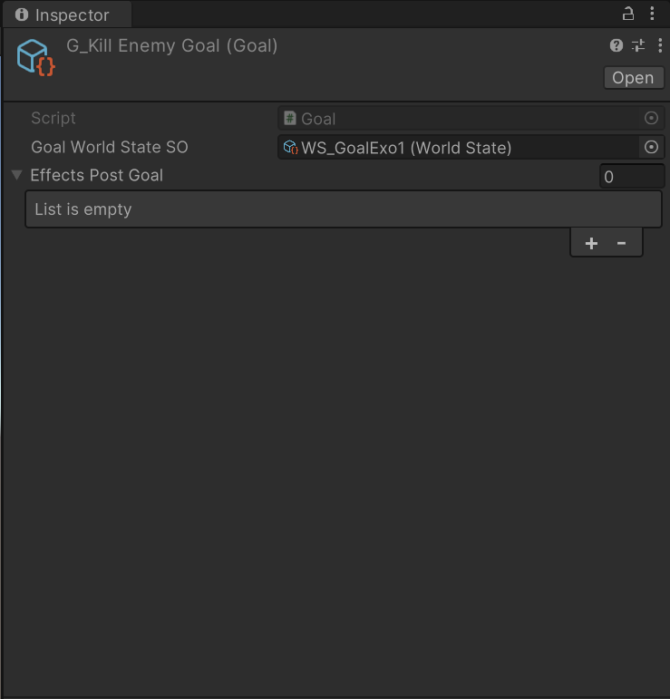

# Goap Planner

 

## Introduction
 `Goap Planner` is a project made on Unity 3D, focused on implementing a Goap planner for artificial intelligence.  
 Thanks to this planner, AIs can plan a sequence of actions to achieve a goal  
 This project has been made by **ERBISTI Matéo**, a programming student at Isart Digital Paris.  
 It started on `January 2nd` and finished on `January 15th`.  

## Description

### GOAP Planner:

The first thing I did in this project was to implement the planner part.   The GraphBuilder script has every function useful to create the plan depending on the goal and action pool.   It uses forward research, and then later in the project, I also implemented the backward research.  
I also have a GOAPPlanner script which is a component and this is where we can put all of our Actions and Goals scriptable objects and it is the script that will call functions from the GraphBuilder.   You can also tick some debug variables to print all of the leaves, the plan generated, and the time it took to create the plan in the console.     
I made the first exercise with the planner and printed in the editor the leaves, plan, and the time it took to generate the plan.   This part didn't need any execution of the plan so it was not the hardest part to make.  
I decided to make all of my actions, goals, and world states scriptable objects to make the Planner more editable in Unity.  
After making the GOAP Planner I decided to implement it in the template given to us to make it work during a real-time execution.  

 
*Result of the first exercise*.  
You can open the **Exercise1** scene to see the results in the console. 

### GoapPlanner in a real-time execution:

Making the GOAP planner work in a real-time execution was a bit harder because it has to take into account that actions can take some time to execute and that the world can change during the execution which can invalidate some actions and make the plan fail.   The planner then needs to regenerate a plan.  
I made a GOAP Executor script that will handle the execution of the plan.   This is the script that will call functions from the current action such as StartAction, ExecuteAction...   It will also check the preconditions of the action and will abort it if it returns false and will ask the GOAPPlanner to generate a new plan.   It will also select the best goal and will replan if the goal changes.  
I created all of my actions, goals, and world states to make it work and I added two AIs to see how they will behave together.   
You can open the **RealTimePlanner** scene to see the results. 

 
*My GOAPPlanner Component for this situation*.  

### WorldState:
The world state scriptable object has a dictionary made of StateType and Boolean. I decided to make a StateType enum to display states' names in the editor instead of putting strings because string comparisons are not good for performances.  
When you create a World State scriptable object you can add states in the dictionary and set their default values.  
As it is not possible to display a dictionary in the Inspector, I created a list of a class containing a StateType and a boolean and I then filled the dictionary in the Awake function.  
 
*The WorldState scriptable object*.  

### Actions:
For my actions, I used two dictionaries to create the list of preconditions and effects.   They are both editable directly in the scriptable object.   You can also choose the base cost of the action and you can add some pre-conditional costs.  
Then in the script when you create a new action you can override different functions to create the behavior that you want such as a StartAction, ExecuteAction, EndAction, AbortAction, and also ProceduralPreconditions if you have a precondition that is more complex than just looking at a worldstate value.    You can also specify a target game object to make the AI move to it and use the IsAtTarget function to know when the AI has reached its destination.   
 
*The Action scriptable object*.  

## Goals: 
Goals scriptable objects will ask you to put a world state object in it which is the goal state.   You can also add some Post Goal Effects to update some values of the world state once the goal is finished.  
To select the best goal, I used a Get Priority function that you can override.   You can choose to return a priority value depending on world state values of anything that you want and the best goal will be the one with the higher priority.  
 
*The Goal scriptable object*.  

### Backward research
The last thing I implemented was backward research.   I didn't find a lot of documentation to make this part so I tried to do it in my own way.   It's certainly not the best way to do it as it is longer than doing a forward research but I tried to make it work.   
One thing that doesn't work with my method is pre-conditional costs.   For the first exercise the pre-conditional cost for Killing the Enemy without a weapon won't work.  
You can activate the backward research by ticking the `Do Backward Research` value in the GOAPPlanner component

 
*Time to generate the plan with the forward research*  
 
*Time to generate the plan with the backward research*  
